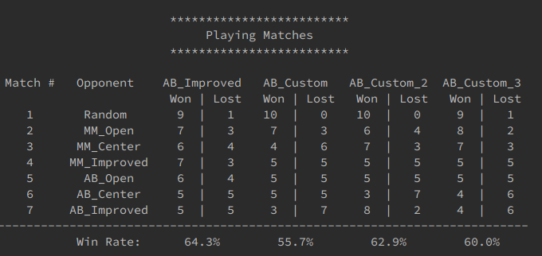

# AIND Project2 Isolation part1
## Selected Heuristics
I prepared Heuristics as below.  
In custom 1, we tried grasping which one is better by taking the difference between the range of movement of ourselves and the opponent. It is because I wanted to minimize the range that the opponent could move.  
In custom 2, I weighted the one with the larger movable range. It is because I wanted to reflect the high degree of choice of my range of movement to the high score rather than conscious of the range of movement of the opponent.  
In custom 3, we chose to preferentially choose the choice that seals the movement of the opponent. I expected the move to go ahead aggressively a little bit.

## Results

In this examination, custom 3 has the best result.
However, repeating the match multiple times sometimes resulted in custom 2 and custom 3 results, so depending on the condition custom 2 may give better results.
At least custom3 has more constraints than custom2, so it can be said that it is more specialized Heuristics.
So we decided that this result is valid.
Of course, I hope to produce a better score, but I think that this will be out of the essence of the project, so I will do so far.

## Future Challenges
In the task of this time, it was necessary for the developer himself / herself to build the evaluation function according to the characteristics of the game.
However, developers are not always strong in games, so we believe there is a limit to how to construct such evaluation functions.
So I think that efforts to automatically generate such evaluation function are necessary.
For example, although it is a combination with reinforcement learning, efforts are also being made to learn a model with a shallow search depth with teacher data as a calculated value of a search model with a deep search depth for calculation of evaluation values.
In this verification, we developed an evaluation formula that matches the game by oneself, but thinking that constructing an evaluation formula based on the above concept also has room for consideration as a future task.